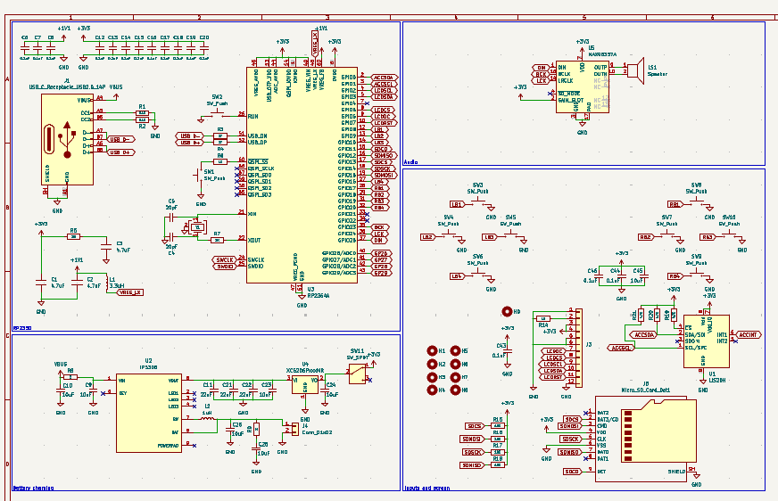

# September 2: Created schematic

The schematic is created. I borrowed most of the elements from my previous project, Tesseract, including the RP2354A, screen FPC connector, mounting holes, battery charging circuit, and SD card. The difference now is I've added 8 push switches, replaced the audio setup with a single chip, the MAX98357A mono I2S amplifier, added an accelerometer (the LIS2DH), and removed the AS5600 wheel. Both 100nF and 10uF decoupling caps were added for the amp + accelerometer.

Time spent: **1 hour**