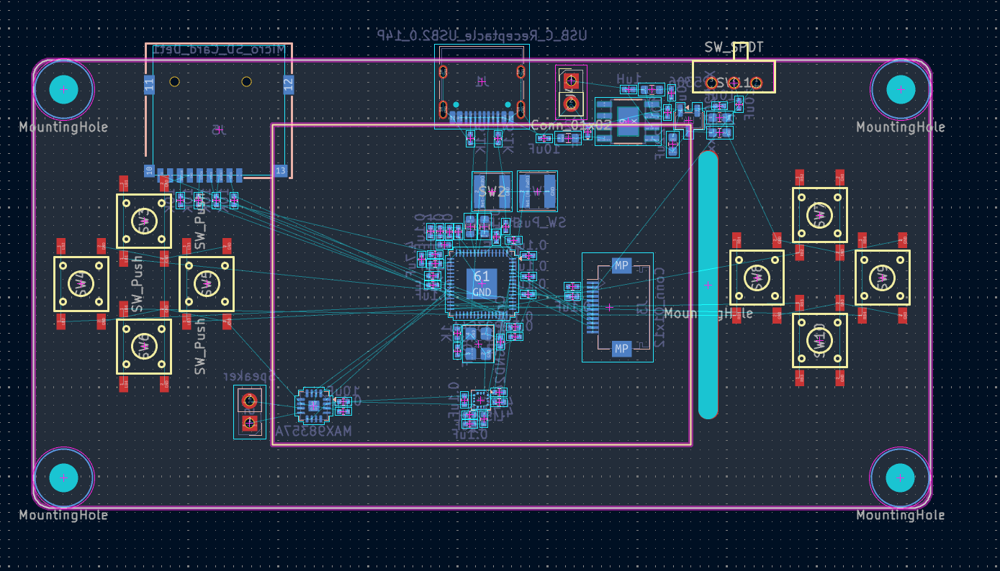

# September 2: Created schematic

The schematic is created. I borrowed most of the elements from my previous project, Tesseract, including the RP2354A, screen FPC connector, mounting holes, battery charging circuit, and SD card. The difference now is I've added 8 push switches, replaced the audio setup with a single chip, the MAX98357A mono I2S amplifier, added an accelerometer (the LIS2DH), and removed the AS5600 wheel. Both 100nF and 10uF decoupling caps were added for the amp + accelerometer.

Time spent: **1 hour**

# September 2: Created PCB layout

The layout is created. The RP2354A and peripherals are dead center, the battery charging is in the top right, and the speaker and accelerometer are in the bottom left. M3 mounting holes are at all 4 corners, and the Edge.Cuts rectangle is rounded with a 2mm fillet. 

- This time around, I added decoupling caps close to as many of the power pins I could. In my previous RP-chip designs, I didn't put them at the power pins, rather all in a line.
- The display hole had to be pushed closer to the display, as otherwise it wouldn't fit the button group. To compensate, I also pushed the FPC connector back.
- I'm still deciding on whether the PCB should be 2 or 4 layer. I might go 2 for simplicity, but the routing will be dense.

Time spent: **2.5 hours**